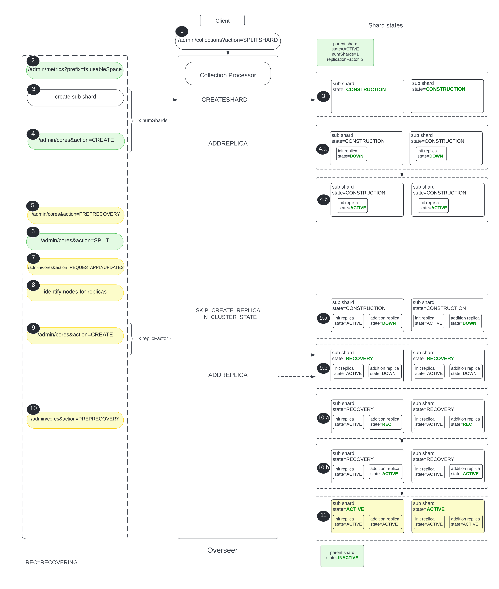

= Shard Split
:toc: macro
:toclevels: 3

The document explains how shard split works in SolrCloud at a high level. This explanation assumes that shard is split into 2 parts using the `default` settings.

toc::[]

== Background
Constantly adding new documents to Solr will slow down query performance as index size increases. To handle this, shard split is introduced. Shard split feature works in both Standalone and SolrCloud modes.

Shard is a logical partition of collection, containing a subset of documents from collection. Which shard contains which document depends on the sharding strategy. It is the "router" that determines this -- e.g. "implicit" vs "compositeId"  When a document is sent to Solr for indexing, the system first determines which shard the document belongs to and finds the leader of that shard. Then the leader forwards the updates to other replicas.

== Shard States
Shard can have one of the following states:

* ACTIVE
** shard receives updates, participates in distributed search.
* CONSTRUCTION
** shard receives updates only from the parent shard leader, but doesn’t participate in distributed search.
** shard is put in that state when shard split operation is in progress or shard is undergoing data restoration.
* RECOVERY
** shard receives updates only from the parent shard leader, but doesn’t participate in distributed search.
** shard is put in that state to create replicas in order to meet collection’s replicationFactor.
* RECOVERY_FAILED
** shard doesn’t receive any updates, doesn’t participate in distributed search.
** shard is put in that state when parent shard leader is not live.
* INACTIVE
** shard is put in that state after it has been successfully split.

Detail: Shard is referred to Slice in the codebase context.

== Shard State Transition Diagram

== Replica States

Replica is a core, physical partition of index, placed on a node. Replica location is `/var/solr/data`.

Replica can have one of the following states:

* ACTIVE
** replica is ready to receive updates and queries.
* DOWN
** replica is actively trying to move to RECOVERING or ACTIVE state.
* RECOVERING
** replica is recovering from leader. This includes peer sync and full replication.
* RECOVERY_FAILED
** recovery didn't succeed.

== Replica State Transition Diagram

== Simplified Explanation

Before digging into the explanation, let us define a few terminologies which will help us understand the content better:

* *parent shard* for a shard which will be split.
* *sub shard* is a new shard to be created after splitting a parent shard.
* *initial replica* is a first replica/core to be added for a sub shard.
* *additional replica* is a replica to be created in order to meet `replicationFactor` of collection.

SPLITSHARD can be split into multiple sub shards when one of the following params is used: `ranges`, `numSubShards`. In this explanation, shard is split into two pieces which are written into disk as two new shards (sub shards).  Behind the scene, original shard's hash range is computed in order to break a shard into two pieces. Furthermore, we can specify `split method` which can be either `rewrite` (default) or `link`.

Simple Shard Split Steps:

* Sub shards are created in `CONSTRUCTION` state.
* Initial replica is created for each sub shard.
* Parent shard leader is “split” (as parent shard can be split into n sub shards, n new indices of sub shards are created).
* Buffered updates are applied on sub shards.
* Additional replicas of sub shards are created (satisfy `replicationFactor` of collection).
* Sub shards become `ACTIVE` and parent shard becomes `INACTIVE`.

Notes:

* No downtime during split process -- on the fly; client continues to query, index; replication factor is maintained.
* `SPLITSHARD` operation is executed by Overseer.
* The demanding I/O when using `splitMethod=rewrite` with the requirement of having enough free disk space i.e., 2x the core size.
* Split operation is async.
* `INACTIVE` shards have to be cleaned up manually.

== Updates while in the process of Shard Split

`UpdateLog` starts to buffer updates on initial replica.
When update request comes to parent shard, parent shard forwards the updates to sub shards. A new transaction log file is created `../replicaName/data/tlog/buffer.tlog.timestamp` for each initial replica of sub shards. `DirectUpdateHandler2` writes the updates to buffer tlog file. Later new updates will be appended at the end of that tlog file.

Apply buffered updates on sub shards:

`UpdateLog` starts log replay. It gets updates from the buffered tlog file (`../replicaName/data/tlog/buffer.tlog.timestamp`) and creates a new transaction log file, `../replicaName/data/tlog/tlog.timestamp` `DirectUpdateHandler2` writes the buffered updates into tlog file.

== Shard Split Process Diagram (High Level)

The following diagram illustrates the shard splitting process at a high level.

== Shard Split Details

Shard split code is mostly in `SplitShardCmd`. Actual index split is processed in `SplitOp`.

1. `SPLITSHARD`, split operation is triggered via Collections API, executed by Overseer. Overseer Collections Handler receives the request and sends it to Collection Processor.

2. Verify if there is enough disk space on the parent shard node to create sub shards.

3. Collection Processor creates a sub shard in `CONSTRUCTION` state and puts it in ZK.

4. Create initial replica/core, `ADDREPLICA → AddReplicaCmd → CoreAdminOperation.CREATE`
    ** 4.a Only `CoreDescriptor` is created; initial replica state is set to `DOWN` by `SliceMutator` .
    ** 4.b Create `SolrCore` from `CoreDescriptor`; initial replica state is updated to `ACTIVE` by `ReplicaMutator`.

5. Initial replica waits for the parent shard leader to acknowledge it, `CoreAdminRequest.WaitForState() → CoreAdminAction.PREPRECOVERY → PrepRecoveryOp`

6. `SPLIT` request is made to `SplitOp` by providing parent shard core, `targetCore` and `splitMethod`; targetCore is the initial replica of each sub shard, `splitMethod=rewrite` by default.
    ** `SplitOp` determines which router is associated with parent shard core.
    ** `SplitIndexCommand` is called to partition the index.
    ** `SolrIndexSplitter` splits index using either REWRITE or LINK method.

7. Apply buffered updates on sub shard replicas. `CoreAdminAction.REQUESTAPPLYUPDATES → RequestApplyUpdatesOp`. `UpdateLog` state has to be `BUFFERING`. `UpdateLog` starts log replay; gets updates from the buffered tlog file and creates a new transaction log file, `/var/solr/data/replicaName/data/tlog/tlog.timestamp`. `DirectUpdateHandler2 writes buffered updates into tlog file`.

8. Identify locations/nodes for the additional replicas to be created.

9. Create additional replica as part of sub shard.
    ** 9.a Skip creating a replica, instead put it in `Overseer`, by setting replica state to `DOWN`.
    ** 9.b As replicationFactor is not 1, SplitShardCmd requests sub shard state to set to `RECOVERY`, executed by `SliceMutator`. And actually create an additional replica/core, but the additional replica state remains `DOWN` because sub shard is in `RECOVERY` state.

10. Wait for replicas to be in RECOVERING state and run replication.
    ** 10.a Set additional replicas state to `RECOVERING`.
    ** 10.b As additional replicas are in `RECOVERING` state, run replication -- replicate from sub shard leader using `ReplicationHandler`.

11. Switch shard states:
    ** update sub shards state from `RECOVERY` to `ACTIVE`.
    ** update parent shard state from `ACTIVE` to `INACTIVE`.

== Testing/Debugging

We can manually test/debug shard split process.

* Configure log levels to `DEBUG` in `log4j2.xml` file, for example:

    <Logger name="org.apache.solr.handler" level="DEBUG"/>
    <Logger name="org.apache.solr.cloud" level="DEBUG"/>
    <Logger name="org.apache.solr.core" level="DEBUG"/>

* Build and run solr in SolrCloud mode
* Create collection, `name=test` with `replicationFactor=2`
* Send the following curl command to solr:

    curl -i -v http://localhost:8983/solr/admin/collections?action=SPLITSHARD&collection=test&shard=shard1

* Add some sleeps -- `Thread.sleep()` in `ShardSplitCmd` and add some documents and finally, observe how new documents are buffered during shard split.

