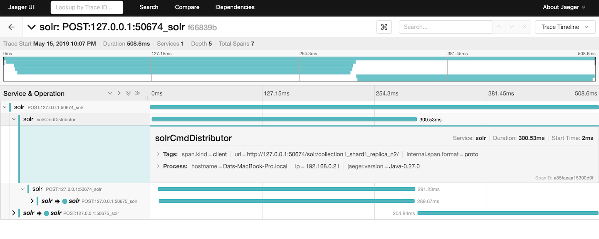

= Distributed Tracing
// Licensed to the Apache Software Foundation (ASF) under one
// or more contributor license agreements.  See the NOTICE file
// distributed with this work for additional information
// regarding copyright ownership.  The ASF licenses this file
// to you under the Apache License, Version 2.0 (the
// "License"); you may not use this file except in compliance
// with the License.  You may obtain a copy of the License at
//
//   http://www.apache.org/licenses/LICENSE-2.0
//
// Unless required by applicable law or agreed to in writing,
// software distributed under the License is distributed on an
// "AS IS" BASIS, WITHOUT WARRANTIES OR CONDITIONS OF ANY
// KIND, either express or implied.  See the License for the
// specific language governing permissions and limitations
// under the License.

Solr includes a general tracing framework based on OpenTracing that can be used to trace lifecycle of a request for performance monitoring.

Tracing data can be configured to send to arbitrary backend like Jaeger, Zipkin, Datadog, etc.
At the moment, only Jaeger is supported out of the box.

A sampled distributed tracing query request on Jaeger looks like this:

.Tracing of a Solr query

== Configuring Tracer

`TracerConfigurator` is a class used to provide an instance of `io.opentracing.Tracer` based on configuration in `solr.xml`.
The `JaegerTracerConfigurator` provides a JaegerTracer instance to a Solr node.

A setup of a `TracerConfigurator` in `solr.xml` looks like this:

[source,xml]
----
<solr>
  <tracerConfig name="tracerConfig" class="org.apache.solr.jaeger.JaegerTracerConfigurator" />
</solr>
----

If `<tracerConfig>` is absent, `TracerConfigurator` will try to pick up the `Tracer` instance that was registered in `io.opentracing.util.GlobalTracer`.
By doing this, some backends like DataDog are supported out of the box since
https://docs.datadoghq.com/tracing/setup/java/[datadog-java-agent] uses Javaagent to register a `Tracer` in
`io.opentracing.util.GlobalTracer`.

== Jaeger Tracer Configurator

The `modules/jagertracer-configurator` provides a default implementation for setting up Jaeger Tracer.

Add the solr-jaegertracer JAR file and the other JARs provided with this module to your Solr installation, ideally to each node.
GSON is a dependency that is only used by Jaeger's "remote" sampler,
which is the default.  Solr doesn't distribute it, so you'll need to add GSON yourself or configure a different sampler.

Then Jaeger tracer is configured in `solr.xml` like this:

[source,xml]
----
<tracerConfig name="tracerConfig" class="org.apache.solr.jaeger.JaegerTracerConfigurator" />
----

_There are no configuration elements in the XML_; instead, this 3rd party system is configured using System Properties or Environment Variables.
The full list are listed at https://github.com/jaegertracing/jaeger-client-java/blob/master/jaeger-core/README.md[Jaeger-README].

For example, to use the probabilistic sampler, you could set this environment variable:

[source,bash]
----
export JAEGER_SAMPLER_TYPE=probabilistic
----

or System property:

[source,bash]
----
bin/solr start -DJAEGER_SAMPLER_TYPE=probabilistic
----
