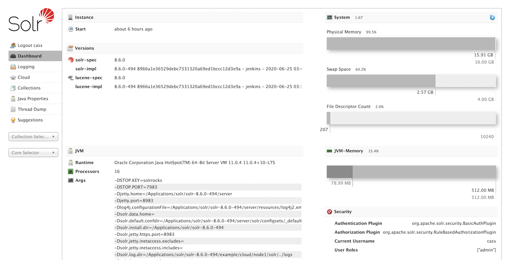
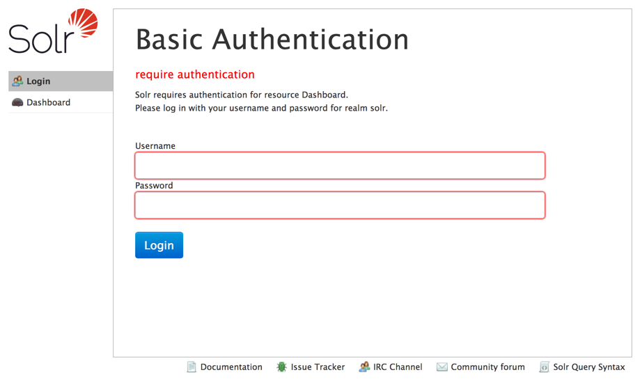
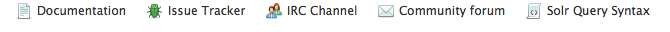
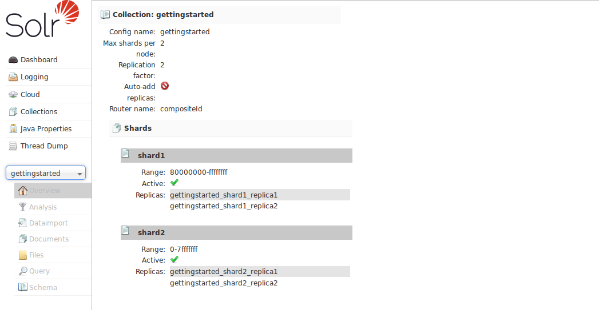
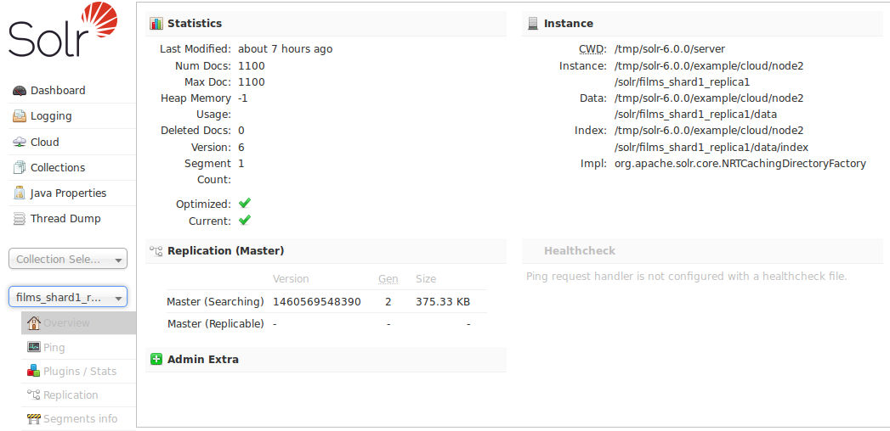

= Solr Admin UI
// Licensed to the Apache Software Foundation (ASF) under one
// or more contributor license agreements.  See the NOTICE file
// distributed with this work for additional information
// regarding copyright ownership.  The ASF licenses this file
// to you under the Apache License, Version 2.0 (the
// "License"); you may not use this file except in compliance
// with the License.  You may obtain a copy of the License at
//
//   http://www.apache.org/licenses/LICENSE-2.0
//
// Unless required by applicable law or agreed to in writing,
// software distributed under the License is distributed on an
// "AS IS" BASIS, WITHOUT WARRANTIES OR CONDITIONS OF ANY
// KIND, either express or implied.  See the License for the
// specific language governing permissions and limitations
// under the License.

[.lead]
Solr features a Web interface that provides online access to many Solr configuration options and features.

== Overview of the Admin UI

=== Dashboard

Accessing the URL `\http://hostname:8983/solr/` will show the main dashboard, which is divided into two parts.

.Solr Dashboard

The left-side of the screen is a menu under the Solr logo that provides the navigation through the screens of the UI.

The first set of links are for system-level information and configuration and provide access to <<configuring-logging.adoc#logging-screen,Logging Screen>>, <<collections-core-admin.adoc#,Collection/Core Administration>>, and <<jvm-settings.adoc#java-properties-screen,Java Properties Screen>>, among other things.

At the end of this information is at least one pulldown listing Solr cores configured for this instance.
On <<cluster-types.adoc#solrcloud-mode,SolrCloud>> nodes, an additional pulldown list shows all collections in this cluster.
Clicking on a collection or core name shows secondary menus of information for the specified collection or core, such as a <<schema-browser-screen.adoc#,Schema Browser>>, <<configuration-files.adoc#files-screen,Files Screen>>, <<plugins-stats-screen.adoc#,Plugins & Statistics>>, and an ability to perform <<query-screen.adoc#,Queries>> on indexed data.

The left-side navigation appears on every screen, while the center changes to  the detail of the option selected.
The Dashboard shows several information items in the center of the screen, including system uptime, the version being run, system-level data, JVM arguments, and the security plugins enabled (if any).

Under the covers, the Solr Admin UI uses the same HTTP APIs available to all clients to access Solr-related data to drive an external interface.

[TIP]
====
The path to the Solr Admin UI given above is `\http://hostname:port/solr`, which redirects to `\http://hostname:port/solr/\#/`.
A convenience redirect is also supported, so simply accessing the Admin UI at `\http://hostname:port/` will also redirect to `\http://hostname:port/solr/#/`.
====

=== Login Screen

If authentication has been enabled, Solr will present a login screen to unauthenticated users before allowing them further access to the Admin UI.

.Login Screen

This login screen currently only works with Basic Authentication.
See the section <<basic-authentication-plugin.adoc#,Basic Authentication Plugin>> for
 details on how to configure Solr to use this method of authentication.

Once logged in, the left-hand navigation will show the current user with an option to logout.

If Kerberos is enabled and the user has a valid ticket, the login screen will be skipped.
However, if the user does not have a valid ticket, they will see a message that they need to obtain a valid ticket before continuing.

=== Getting Assistance

At the bottom of each screen of the Admin UI is a set of links that can be used to get more assistance with configuring and using Solr.

.Assistance icons

These icons include the following links.

[%autowidth.stretch,options="header"]
|===
|Link |Description
|Documentation |Navigates to the Apache Solr documentation hosted on https://solr.apache.org/.
|Issue Tracker |Navigates to the JIRA issue tracking server for the Apache Solr project.
This server resides at https://issues.apache.org/jira/browse/SOLR.
|IRC Channel |Navigates to Solr's http://en.wikipedia.org/wiki/Internet_Relay_Chat[IRC] live-chat room: http://webchat.freenode.net/?channels=#solr.
|Community forum |Navigates to the Apache Wiki page which has further information about ways to engage in the Solr User community mailing lists: https://cwiki.apache.org/confluence/display/solr/UsingMailingLists.
|Solr Query Syntax |Navigates to the section <<query-syntax-and-parsers.adoc#,Query Syntax and Parsing>> in this Reference Guide.
|===

These links cannot be modified without editing the `index.html` in the `server/solr/solr-webapp` directory that contains the Admin UI files.

== Collection-Specific Tools

In the left-hand navigation bar, you will see a pull-down menu titled Collection Selector that can be used to access collection specific administration screens.

.Only Visible When Using SolrCloud
[NOTE]
====
The Collection Selector pull-down menu is only available on Solr instances running <<cluster-types.adoc#solrcloud-mode,SolrCloud>>.

User-managed clusters or single-node installations will not display this menu, instead the Collection specific UI pages described in this section will be available in the <<Core-Specific Tools,Core Selector pull-down menu>>.
====

Clicking on the Collection Selector pull-down menu will show a list of the collections in your Solr cluster, with a search box that can be used to find a specific collection by name.
When a collection is selected, the main body of the page will display some  metadata about the collection.
A secondary menu will appear in the left nav with links to additional collection specific administration screens.

== Core-Specific Tools

The Core-Specific tools are a group of UI screens that allow you to see core-level information.

In the left-hand navigation bar, you will see a pull-down menu titled Core Selector.
Clicking on the menu will show a list of Solr cores hosted on this Solr node, with a search box that can be used to find a specific core by name.

When you select a core from the pull-down, the main display of the page will show some basic metadata about the core, and a secondary menu will appear in the left nav with links to additional core specific administration screens.

.Core overview screen

== Links to UI Documentation
Here are sections throughout the Guide describing each screen of the Admin UI:

*Primary UI Tools*

****
// This tags the below list so it can be used in the parent page section list
// tag::ui-common-tools[]
[cols="1,1",frame=none,grid=none,stripes=none]
|===
| <<configuring-logging.adoc#logging-screen,Logging Screen>>: Recent log messages and configuration of log levels.
| <<cloud-screens.adoc#,Cloud Screens>>: Access to SolrCloud node data and status.
| <<collections-core-admin.adoc#,Collections / Core Admin>>: Collection or Core management tools.
| <<jvm-settings.adoc#java-properties-screen,Java Properties Screen>>: Java information for each core.
| <<thread-dump.adoc#,Thread Dump Screen>>: Detailed thread and state information.
|
|===
// end::ui-common-tools[]
****

*Collection-Specific Tools*

****
// This tags the below list so it can be used in the parent page section list
// tag::ui-collection-tools[]
[cols="1,1",frame=none,grid=none,stripes=none]
|===
| <<analysis-screen.adoc#,Analysis Screen>>: Test and validation tool for field type analyzers.
| <<documents-screen.adoc#,Documents Screen>>: Form-based document updates using the Admin UI.
| <<configuration-files.adoc#files-screen,Files Screen>>: Configuration file browser.
| <<query-screen.adoc#,Query Screen>>: Form-based query builder.
| <<stream-screen.adoc#,Stream Screen>>: Submit streaming expressions and see results and parsing explanations.
| <<schema-browser-screen.adoc#,Schema Browser Screen>>: Field-level schema details.
|===
// end::ui-collection-tools[]
****

*Core-Specific Tools*

****
// This tags the below list so it can be used in the parent page section list
// tag::ui-core-tools[]
[cols="1,1",frame=none,grid=none,stripes=none]
|===
| <<ping.adoc#,Ping>>: Ping a named core to determine whether it is active.
| <<plugins-stats-screen.adoc#,Plugins/Stats Screen>>: Statistics for request handlers, search components, plugins, and other installed components.
| <<user-managed-index-replication.adoc#replication-screen,Replication Screen>>: Enable replication for a core and view current replication status.
| <<index-segments-merging.adoc#segments-info-screen,Segments Info Screen>>: Visualization of the underlying Lucene index segments.
|===
// end::ui-core-tools[]
****
